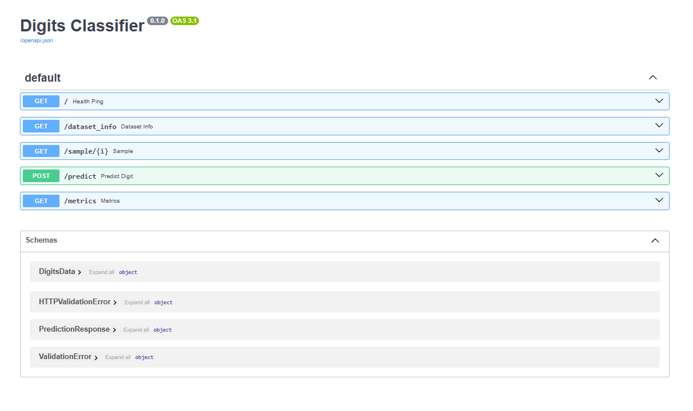
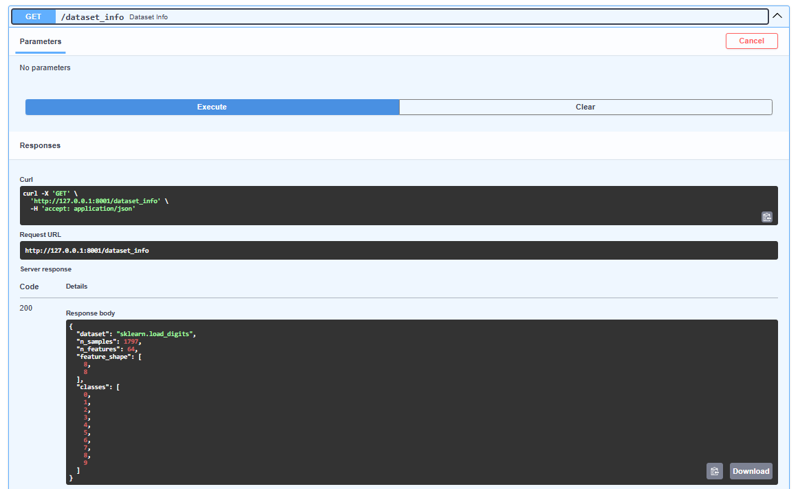
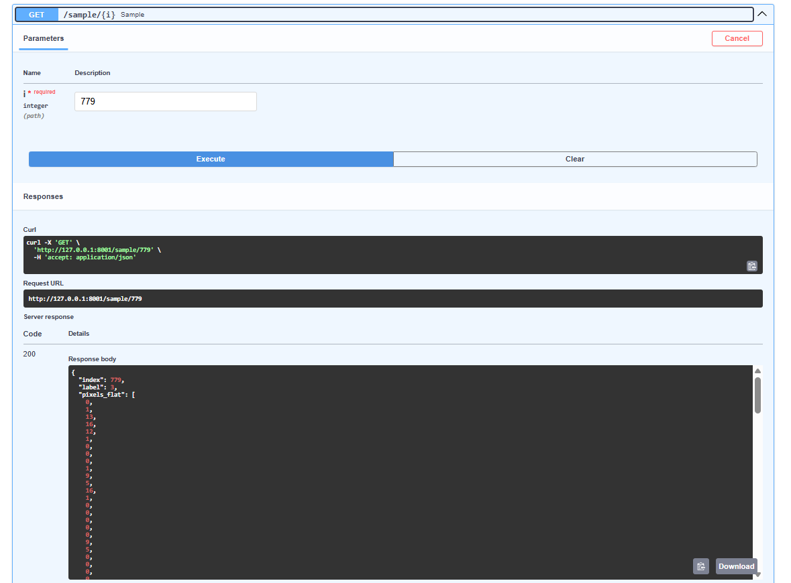
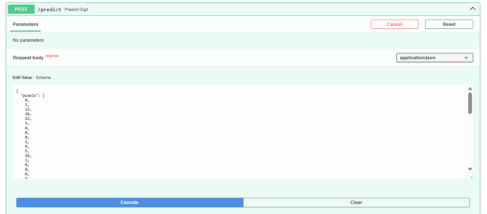
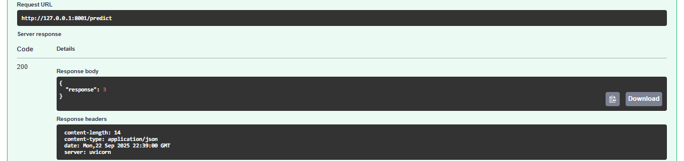
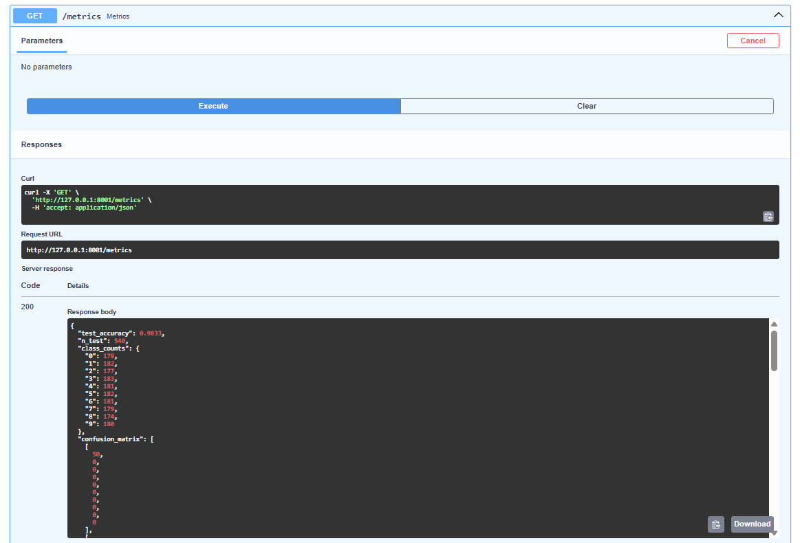

# Digits Classifier

In this lab, you’ll expose an ML model as a web API using **[FastAPI](https://fastapi.tiangolo.com/)** and **[Uvicorn](https://www.uvicorn.org/)**.

- **FastAPI**: a modern, high-performance web framework for building APIs in Python (built on type hints).
- **Uvicorn**: an ASGI (Asynchronous Server Gateway Interface) web server commonly used to run FastAPI applications.

**Workflow overview**
1. Train a **Support Vector Machine (SVM)** classifier on scikit-learn’s **Digits** dataset (8×8 grayscale images, labels 0–9).
2. Serve the trained model as an API using **FastAPI** and **Uvicorn**.

---

## Project Structure

```
FastAPI_Lab1/
├─ model/
│  └─ digits_model.pkl              # saved sklearn model/pipeline (created by training)
├─ src/
│  ├─ __init__.py
│  ├─ data.py                       # load_data(), split_data()
│  ├─ train.py                      # fit_model() -> saves model/digits_model.pkl
│  ├─ predict.py                    # predict_data(X) using the saved model
│  └─ main.py                       # FastAPI app (health, predict, metrics, etc.)
├─ README.md
└─ requirements.txt
```

---

## Setting Up the Lab

1. **Create a virtual environment** (e.g., `fastapi_lab1_env`).
2. **Activate** the environment and **install dependencies** with `pip install -r requirements.txt`.

> **Note**: `fastapi[all]` in `requirements.txt` installs extra optional packages for FastAPI, including **uvicorn**.

---

## Running the Lab

```powershell
# 1) Create and activate a virtual environment
python -m venv fastapi_lab1_env
fastapi_lab1_env\Scripts\activate

# 2) Install dependencies
pip install -r requirements.txt

# 3) Train the model (creates model/digits_model.pkl)
python -m src.train

# 4) Run the API (use a free port like 8001 on Windows)
uvicorn src.main:app --reload --host 127.0.0.1 --port 8001
```

Now open the interactive docs at **http://127.0.0.1:8001/docs**.



You can test endpoints directly in the Swagger UI:  
open an endpoint → **Try it out** → fill the request body → **Execute**.

---

## 📖 How the Code Works

### 1) `src/data.py`
- **`load_data()`** returns `(X, y)` for the **Digits** dataset.  
  - `X.shape == (1797, 64)` (flattened 8×8 images)  
  - `y.shape == (1797,)`, labels in `0..9`
- **`split_data(X, y)`** returns `(X_train, X_test, y_train, y_test)` using a **70/30 split** and `random_state=12` (mirrors the original Iris lab).

### 2) `src/train.py`
- **`fit_model(X_train, y_train)`** trains a pipeline and saves it to `model/digits_model.pkl`:
  - `StandardScaler()` → `SVC(kernel="rbf", C=3.0, gamma="scale", probability=True)`
  - This combo typically achieves **~97–99% accuracy** on the Digits test split.
- Run directly to (re)train:
  ```powershell
  python -m src.train
  ```

### 3) `src/predict.py`
- **`predict_data(X)`** loads the saved model once (cached) and predicts labels for any `(n_samples, 64)` input.

### 4) `src/main.py` (FastAPI)
**Endpoints**
- `GET /` – health check
- `POST /predict` – classify a digit from a flattened 64-value pixel vector
- `GET /dataset_info` – dataset stats (samples, features, classes)
- `GET /sample/{i}` – return raw pixels + true label for a specific sample
- `GET /metrics` – compute accuracy and confusion matrix on a held-out test split


---

## 🧪 Using the API

### 1) Open the docs
Navigate to **`/docs`** in your browser to try all endpoints.

### 2) Get dataset info
**Request**
```
GET /dataset_info
```
**Response**
- Returns counts, feature shape, and class list.

- Dataset info:  
  

### 3) Inspect a sample
**Request**
```
GET /sample/{i}
```

**Response**
```json
{
  "index": 779,
  "label": 3,
  "pixels_flat": [64 numbers...],
  "pixels_8x8": [[8x8 grid...]]
}
```
- Sample endpoint:  
  
  
### 4) Predict a digit
Copy the `pixels_flat` array from `/sample/{i}` and send to `/predict`.

**Request**
```
POST /predict
Content-Type: application/json
{
  "pixels": [0, 1, 13, 16, 12, 1, 0, 0, ... 64 numbers total ...]
}
```

**Response**
```json
{ "response": 3 }
```

**cURL example**
```bash
curl -X POST "http://127.0.0.1:8001/predict" \
  -H "Content-Type: application/json" \
  -d "{\"pixels\": [0,2,14,16,16,13,5,0,0,7,16,13,8,8,1,0,0,10,15,0,0,0,0,0,0,10,16,0,0,0,0,0,0,7,16,6,0,0,0,0,0,1,12,16,8,0,0,0,0,1,8,16,10,0,0,0,0,3,16,15,1,0,0,0]}"
```
- Predict (example):  
  
  
### 5) View metrics
**Request**
```
GET /metrics
```
**Response**
- Returns test accuracy, class counts, and a confusion matrix.

---
- Metrics:  
  
## Tips & Notes

- If port 8000 is blocked on Windows (e.g., `WinError 10013`), use a different port: `--port 8001`.
- Your virtual environment prompt should show `(fastapi_lab1_env)` when active.
- If you see Pydantic validation errors, remember we’re on **Pydantic v2**, so list length checks use:
  ```py
  Field(..., min_length=64, max_length=64)
  ```

---
```
